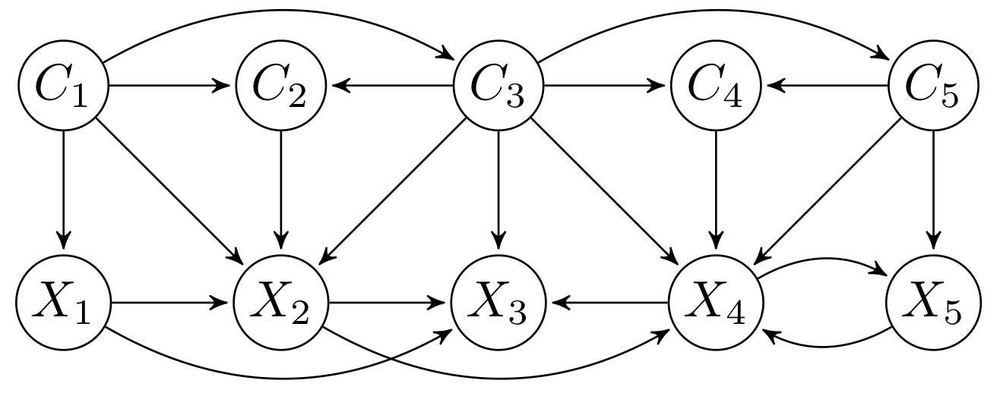
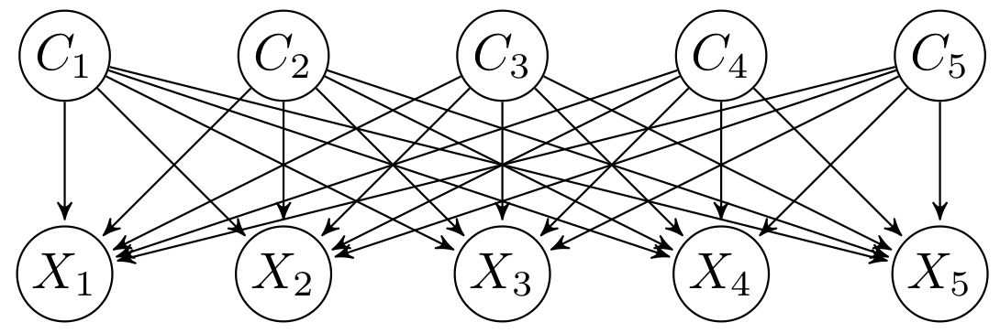
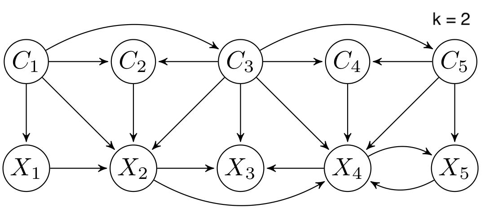
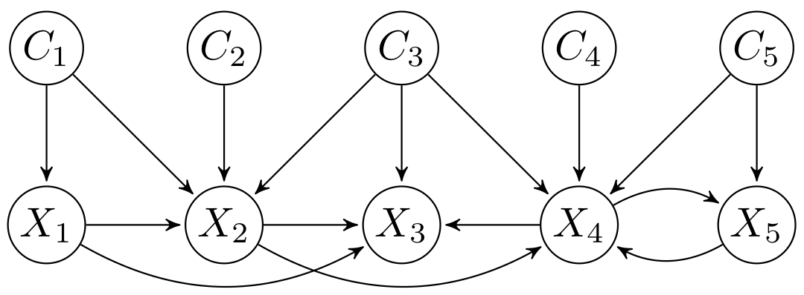
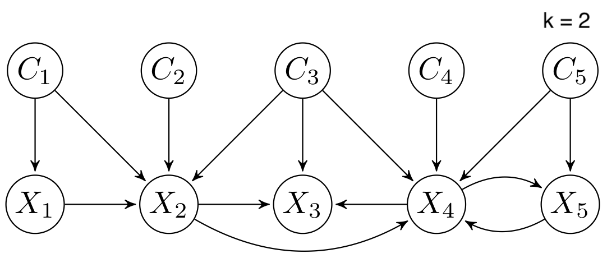

#  <a href="http://cig.fi.upm.es">  </a>
[](https://github.com/carlvilla/Multi-CTBNCs_private/blob/master/LICENSE) [](https://dl.circleci.com/status-badge/redirect/gh/carlvilla/Multi-CTBNCs_private/tree/master) [](https://codecov.io/gh/carlvilla/Multi-CTBNCs_private)

## Description

CTBNLab provides an easy-to-use tool for anyone to apply continuous-time Bayesian networks (CTBNs) in their research. Currently, the software supports learning multidimensional continuous-time Bayesian network classifiers (Multi-CTBNCs), providing different algorithms to learn the structure and parameters of several families of these classifiers, as well as to evaluate their performance or classify previously unseen datasets.

The Multi-CTBNCs are an extension of the CTBNs for the multidimensional classification of multivariate time series. These probabilistic graphical models are able to model temporal data evolving over continuous time and classify them into multiple class variables taking advantage of the information provided by inter-class dependencies. This is a common and essential task for domains such as finance, industry, medicine or signal processing, but applications can be found in almost any field.

## Table of content

- [Installation](#installation)
- [Usage](#usage)
- [Supported datasets](#supported-datasets)
- [Learning Multi-CTBNCs](#learning-multi-ctbncs)
    - [Parameter learning algorithms](#parameter-learning-algorithms)
    - [Structure learning algorithms](#structure-learning-algorithms)
        - [Score-based algorithms](score-based-algorithms)
            - [Optimisation algorithms](#optimisation-algorithms)
            - [Score functions](#score-functions)
            - [Available models by structure constraints](#available-models-by-structure-constraints)
        - [Constraint-based algorithms](#constraint-based-algorithms)
        - [Hybrid algorithms](hybrid-algorithms)
- [Reproducibility of experiments](#reproducibility-of-experiments)
- [Sampling synthetic datasets](#sampling-synthetic-datasets)
- [References](#references)

## Installation
This software has been developed as a Gradle project to facilitate its usage and the management of its dependencies. As the Gradle Wrapper is provided, only a Java Development Kit (JDK) needs to be installed ([Java SE Downloads](https://www.oracle.com/java/technologies/javase-downloads.html)).

Alternatively, it is possible to use the Linux, macOS and Windows executables included in the [latest release](https://github.com/carlvilla/Multi-CTBNCs/releases/latest) of this repository, which do not require any previous installation. In order to view the log messages on macOS and Linux systems, use the following commands in the terminal:

On macOS:
```sh
./Multi-CTBNCs.app/Contents/MacOS/Multi-CTBNCs
```
On Linux:
```bat
./opt/multi-ctbncs/bin/Multi-CTBNCs
```

## Usage

1. Download the repository:

    ```sh
    git clone https://github.com/carlvilla/Multi-CTBNCs.git
    ```
  
2. Navigate to the repository's root directory:

    ```sh
    cd Multi-CTBNCs
    ```

3. Run the application:

      On Linux / macOS:
      ```sh
      ./gradlew run
      ```
      On Windows:
      ```bat
      .\gradlew.bat run
      ```
  

These steps will open the application interface, where it is possible to specify datasets for training, evaluation or classification, the model to build, learning algorithms and evaluation methods. The interface consists of four tabs:

* The **Dataset tab**: allows to specify the data to train and evaluate a Multi-CTBNC. We can determine how the sequences will be extracted and which time, class and feature variables will be used.
* The **Model tab**: allows to specify the model that will be trained. 
* The **Evaluation tab**: allows to define how the model selected in the *Model* tab will be evaluated using the data provided in the *Dataset* tab.
* The **Classification tab**: allows to train the model selected in the *Model* tab with the data provided in the *Dataset* tab and to classify a second dataset with this model. The classification results are saved in the folder *results/classifications* in the project root directory.

<p align="center"></p>

## Supported datasets
Time series datasets can be stored and presented in different formats. Currently, this software supports the following:

* **Multiple CSVs**: sequences are stored in individual CSV files.
* **Single CSV**: sequences of a predefined maximum length are extracted from a single CSV file. In the case of the training dataset, the extracted sequences will have the same length as long as their observations have the same class configuration.

## Learning Multi-CTBNCs
This software provides the following learning algorithms for a Multi-CTBNC.
### Parameter learning algorithms
* **Maximum likelihood estimation**: assumes that the parameters are constants, seeking those values that maximise the probability of the observable data.
* **Bayesian estimation**: parameters are considered random variables, and a prior distribution is defined over them.

### Structure learning algorithms

#### Score-base algorithms

##### Optimisation algorithms
* **Hill climbing**: an iterative algorithm that performs incremental modifications over the model structure and selects those that yield a better solution.
* **Random-restart hill climbing**: performs a series of hill climbing optimisations starting from random initial structures and keeps the best solution.
* **Tabu search**: local search method that employs an adaptive memory (tabu list) to avoid recently visited solutions and getting stuck on local optima.

##### Score functions
* **Log-likelihood score**
* **Conditional log-likelihood score**
* **Bayesian Dirichlet equivalent score**

The following penalisation functions can be applied over the structure complexity when optimising the log-likelihood and conditional log-likelihood scores:

* **BIC penalisation**
* **AIC penalisation**

##### Available models by structure constraints

Different families of Multi-CTBNCs can be proposed depending on the search spaces considered for the class and feature subgraphs. Currently, this software supports the following Multi-CTBNC families:

* **Multidimensional continuous time Bayesian network classifier (Multi-CTBNC)**: no structure constraints.

<p align="center">  </p>

* **Multidimensional continuous time naive Bayes classifier (Multi-CTNBC)**: assumes conditional independence between features given the class variables and independence between the latter. The model is formed by a complete bridge subgraph, so each class variable is the parent of all features.

<p align="center">  </p>

* **DAG-maxK multidimensional continuous time Bayesian network classifier (DAG-maxK Multi-CTBNC)**: feature nodes have at most k parents (excluding class variables).

<p align="center">  </p>

* **Empty-digraph multidimensional continuous time Bayesian network classifier (Empty-digraph Multi-CTBNC)**: dependencies between class variables are ignored.

<p align="center">  </p>

* **Empty-maxK multidimensional continuous time Bayesian network classifier (Empty-maxK Multi-CTBNC)**: feature nodes have at most k parents (excluding class variables), and dependencies between class variables are ignored.

<p align="center">  </p>

#### Constraint-based algorithms
* **Continuous-time PC**: adapts the classical PC algorithm to reconstruct the structure of CTBNs by performing conditional independence tests.
* **Markov blanket-based continuous-time PC**: extension of the continuous-time PC algorithm that seeks to evaluate only those relevant dependencies for the Markov blanket (parents, children and spouses) of class variables.
* **Online Markov blanket-based continuous-time PC**:  extended version of the Markov blanket-based continuous-time PC algorithm designed for dynamic learning of Multi-CTBNCs in data streams. It locally updates the structure of a Multi-CTBNC when concept drifts are detected in its nodes.

#### Hybrid algorithms
* **Hybrid algorithm**: algorithm that combines the frameworks of constraint- and score-based algorithms into a restriction phase where conditional independence tests find an initial structure and a maximisation phase that refines it.

## Reproducibility of experiments

Datasets used in the article [[1]](#1) can be found at this [link](https://drive.upm.es/s/hP7HYYub39knhvl). Updated datasets used in Chapter 5 of my dissertation can be dowloaded from [link](https://drive.upm.es/s/Hwmv4pHI0omOh2K). The following Gradle tasks perform the experiments of this article if the *dataset* folder is placed in the root directory of this project:

* **emptyDigraphMultiCTBNC** - Compares the performance of CTBNCs and an empty-digraph Multi-CTBNC on the synthetic datasets when learnt with the Bayesian Dirichlet equivalent score.
* **energyBDe** - Compares the performance of max1 CTBNCs and a DAG-max1 Multi-CTBNC on the energy dataset when learnt with the Bayesian Dirichlet equivalent score.
* **energyBIC** - Compares the performance of max1 CTBNCs and a DAG-max1 Multi-CTBNC on the energy dataset when learnt with the BIC-penalised log-likelihood score.
* **runAllExperimentsVillaBlancoEtAl2021** - Runs all the experiments with the synthetic and energy datasets from [[1]](#1).
* **syntheticBDe** - Compares the performance of CTBNCs and a Multi-CTBNC on the synthetic experiments when learnt with the Bayesian Dirichlet equivalent score.
* **syntheticCLL** - Compares the performance of CTBNCs and a Multi-CTBNC when learnt with the conditional log-likelihood score penalised with BIC.
* **syntheticLL** - Compares the performance of CTBNCs and a Multi-CTBNC when learnt with the log-likelihood score penalised with BIC.

The synthetic datasets used for the experiments of article [[3]](#3) can be downloaded from [link](https://drive.upm.es/s/ajygY8utGvN1KkK). The BHPS dataset (see [[4]](#4)) can be obtained from [link](https://beta.ukdataservice.ac.uk/datacatalogue/studies/study?id=5151). The following Gradle tasks perform the experiments of this article if the *dataset* folder is placed in the root directory of this project:

* **britishHouseholdPanelSurvey** - Experiments to evaluate the performance of the structure learning algorithms on a real-world dataset (see [[4]](#4)).
* **highDimensionality** - Experiments to evaluate the difference in learning time of the algorithms when the dimensionality of the datasets increases significantly.
* **increaseFeatureStates10Duration** - Experiments to evaluate the influence of the cardinality of feature variables on the performance of algorithms when sequences have a duration of 10 time units.
* **increaseFeatureStates20Duration** - Experiments to evaluate the influence of the cardinality of feature variables on the performance of algorithms when sequences have a duration of 20 time units.
* **mainExperiments** - Comprehensive experiments over randomly generated datasets using a different number of class and feature variables, cardinalities and density of the structures.
* **noisyData** - Experiments to evaluate the influence of noise on the performance of the structure learning algorithms.
* **runAllSyntheticExperimentsVillaBlancoEtAl2022** - Runs all the experiments from [[3]](#3).

The synthetic datasets used for experiments conducted in Chapter 8 of my dissertation can be downloaded from [link](http://138.100.13.116:8080/s/rAHhG7nBo4aHn2W). The following Gradle tasks conduct all the experiments of the chapter if the datasets are placed in a *dataset* folder in the root directory of this project:

* **runAllExperimentsDataStreams** - evaluates the performance of Multi-CTBNCs across a range of data stream scenarios. This includes scenarios with stationary, gradual and abrupt concept drifts, and different update strategies (no update, local update, and global update).
* **runAllExperimentsFeatureStreams** - evaluates the performance of Multi-CTBNCs when processing feature streams with different numbers of features, ranging from 25 to 125. It studies different training setups, including batch training and model retraining, both with and without the integration of an online feature subset selection algorithm.

The tasks can be executed with the following command:

On Linux / macOS:
```sh
./gradlew <task>
```
On Windows:
```bat
gradlew.bat <task>
```

Excel files with the results of the experiments will be saved in the folder *results/experiments* in the project root directory.

## Sampling synthetic datasets

This software provides the tools to sample discrete state multivariate time series datasets with multiple class variables. Datasets can be generated with the following command:
```sh
./gradlew sampleDatasets --args="<number datasets to sample> <number sequences> <duration sequences> <number feature variables> <cardinality feature variables> <number class variables> <cardinality feature variables> <probability arc in class subgraph> <probability arc in bridge subgraph> <probability arc in feature subgraph> <maximum number of feature variables that can be parents of others> <true to add > <true to generate four datasets with different levels of noise> <destination path datasets> <adjacency matrix (optional, arguments 7 to 11 are ignored if used)>."
```

The following example generates five datasets with 5000 sequences of 20 time units. The datasets contain 20 feature variables with six states and four class variables with three states, and different structures are randomly generated for each dataset using densities of 30% for the class subgraph and 10% for the feature and bridge subgraphs. In addition, feature variables are restricted to a maximum of three other feature variables as parents. The resulting datasets are saved in the directory *datasets/example_dataset*.
```sh
./gradlew sampleDatasets --args="5 5000 20 10 6 5 3 0.3 0.1 0.1 3 true false datasets/example_dataset"
```

As for the next example, the adjacency matrix to be used is specified:
```sh
./gradlew sampleDatasets --args="1 10000 30 3 4 3 3 0 0 0 0 false false datasets/example_dataset false,true,false,false,false,false//false,false,true,false,false,false//false,true,false,false,false,false//true,true,false,false,true,false//false,true,false,false,false,true//false,true,true,false,false,false"
```

In order to generate the datasets used in the articles [[1]](#1) and [[3]](#3), the following predefined tasks can be employed:

* **sampleDatasetsVillaBlancoEtAl2021** - Samples all the datasets used in the article [[1]](#1).
* **sampleDatasetsVillaBlancoEtAl2023** - Samples all the datasets used in the article [[3]](#3).

Datasets are saved in the *dataset* folder in the root directory of this project.

## References

<a id="1">[1]</a> 
C. Villa-Blanco, P. Larrañaga, and C. Bielza. Multidimensional continuous time Bayesian network classifiers. <em>International Journal of Intelligent Systems}</em>, 36(12):7839–7866, 2021. doi:[10.1002/int.22611](https://doi.org/10.1002/int.22611).

<a id="2">[2]</a>
C. Villa-Blanco, A. Bregoli, C. Bielza, P. Larrañaga, and F. Stella. Structure learning algorithms for multidimensional continuous-time Bayesian network classifiers. In <em>Proceedings of The 11th International Conference on Probabilistic Graphical Models</em>, volume 186, pages 313–324. 2022.

<a id="3">[3]</a>
C. Villa-Blanco, A. Bregoli, C. Bielza, P. Larrañaga, and F. Stella. Constraint-based and hybrid structure learning of multidimensional continuous-time Bayesian network classifiers. <em>International Journal of Approximate Reasoning</em>, 159:108945, 2023. doi:[10.1016/j.ijar.2023.108945](https://doi.org/10.1016/j.ijar.2023.108945).

<a id="4">[4]</a>
University of Essex, Institute for Social and Economic Research. British household panel survey: Waves 1-18, 1991-2009. [data collection]. 8th edition. 2018. doi:[10.5255/UKDA-SN-5151-2](https://doi.org/10.5255/UKDA-SN-5151-2).
