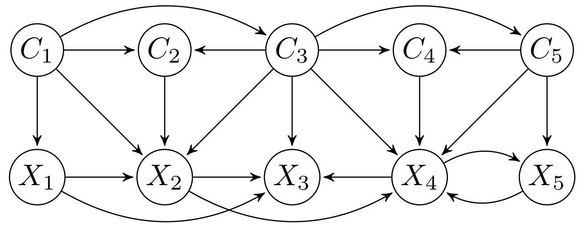
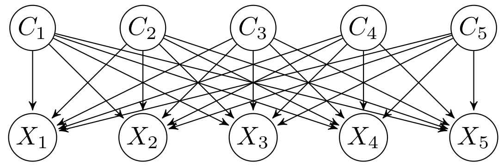
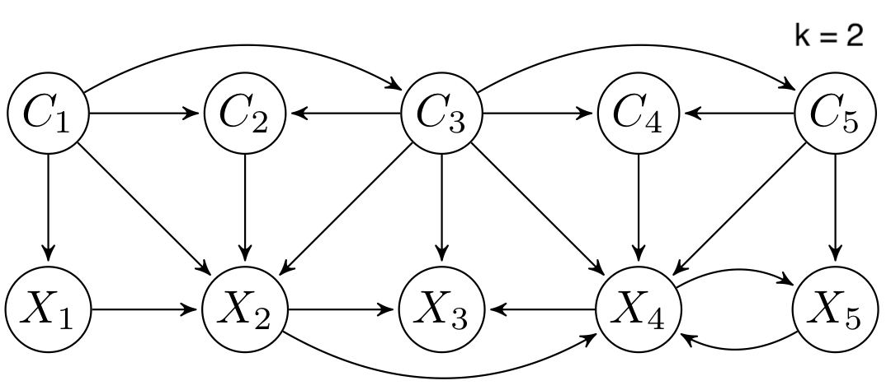
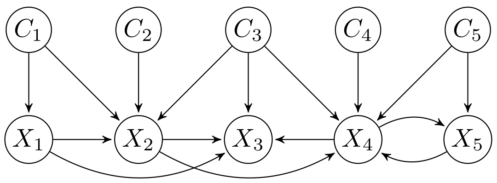
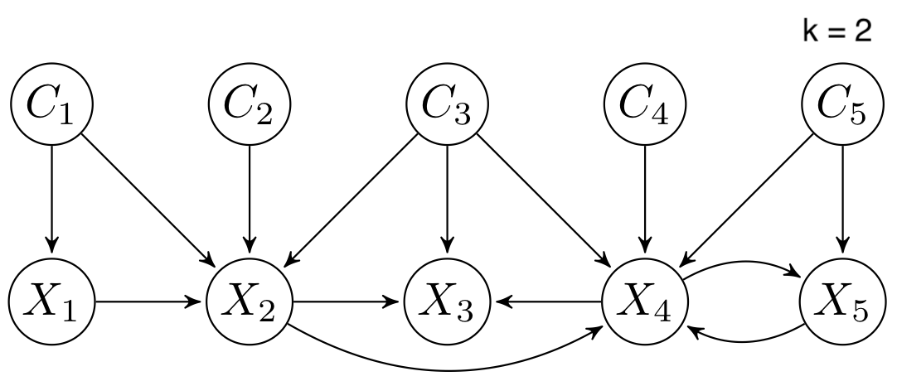

<h1 align="center">
  MCTBNCs
</h1>
<p align="center">  </p>
<p align="center">Multi-dimensional continuous time Bayesian network classifiers</p>
<p align="center">
<a href="https://travis-ci.com/carlvilla/MCTBNCs">  </a>     
<a href="http://cig.fi.upm.es">  </a>
</p>

## Description

The multi-dimensional continuous time Bayesian network classifiers (MCTBNCs) are an extension of continuous time Bayesian networks for the multi-dimensional classification of multi-variate time series. These probabilistic graphical models are able to modelate temporal data evolving over continuous time and classify them into multiple class variables taking advantage of the information provided by inter-class dependecies. This is a common and important task for domains such as finance, industry, medicine or signal processing, but applications can be found in almost any field.

This software provides an easy-to-use tool, so anyone can apply MCTBNCs in their research. Multiple options are available to learn the structure and parameters of different families of MCTBNCs, as well as to evaluate the models or classify previously unseen datasets.

## Table of content

- [Installation](#installation)
- [Usage](#usage)
- [Supported datasets](#supported-datasets)
- [Learning MCTBNCs](#learning-mctbncs)
    - [Parameter learning algorithms](#parameter-learning-algorithms)
    - [Structure learning algorithms](#structure-learning-algorithms)
        - [Optimization algorithms](#optimization-algorithms)
        - [Score functions](#score-functions)
        - [Available models by structure constraints](#available-models-by-structure-constraints)
- [Reproducibility of experiments](#reproducibility-of-experiments)

## Installation
This software has been developed as a Gradle project to facilitate its usage and the management of its dependencies. As the Gradle Wrapper is provided, only a Java Development Kit (JDK) needs to be installed ([Java SE Downloads](https://www.oracle.com/java/technologies/javase-downloads.html)).


## Usage

1. Download the repository:

    ```sh
    git clone https://github.com/carlvilla/MCTBNCs.git
    ```
  
2. Navigate to the repository's root directory:

    ```sh
    cd MCTBNCs
    ```

3. Run the application:

      Run on Linux / macOS:
      ```sh
      ./gradlew run
      ```
      Run on Windows:
      ```bat
      gradlew.bat run 
      ```
  

These steps will open the application interface, through which you can specify your datasets for training, evaluation or classification, model to build, learning algorithms and evaluation methods. The interface consists of four tabs:

* The **Dataset tab**: allows to specify the data to train and evaluate an MCTBNC. We can specify how the sequences will be extracted and which time, class and feature variables will be used.
* The **Model tab**: allows to specify the model that will be trained. 
* The **Evaluation tab**: allows to define how the model selected in the "Model" tab will be evaluated using the data provided in the "Dataset" tab.
* The **Classification tab**: allows to train the model selected in the "Model" tab with the data provided in the "Dataset" tab and to classify a second dataset with this model. The classification results are saved in the folder *results/classifications* in the project root directory.

<p align="center"></p>

## Supported datasets
Time series datasets can be stored and presented in different formats. Currently, this software supports the following:

* **Multiple CSVs**: sequences are stored in individual CSV files.
* **Single CSV**: sequences of a predefined maximum length are extracted from a single CSV file. In the case of the training dataset, the extracted sequences will have the same length as long as their observations have the same class configuration.

## Learning MCTBNCs
This software provides the following learning algorithms for a MCTBNC.
### Parameter learning algorithms
* **Maximum likelihood estimation**: assumes that the parameters are constants, seeking those values that maximize the probability of the observable data.
* **Bayesian estimation**: parameters are considered random variables and a prior distribution is defined over them.

### Structure learning algorithms
#### Optimization algorithms
* **Hill climbing**: iterative algorithm that performs incremental modifications over the model structure and selects those that yield to a better solution.
* **Random-restart hill climbing**: performs a series of hill climbing optimizations starting from random initial structures and keeps the best solution.

#### Score functions
* **Log-likelihood score**
* **Conditional log-likelihood score**
* **Bayesian Dirichlet equivalent score**

The following penalization functions can be applied over the structure complexity when optimizing the log-likelihood and conditional log-likelihood scores:
  * **BIC penalization**
  * **AIC penalization**

#### Available models by structure constraints

Different families of MCTBNCs can be proposed depending on the search spaces considered for the class and feature subgraphs. Currently, this software supports the following MCTBNC families:

* **Multi-dimensional continuous time Bayesian network classifier (MCTBNC)**: no structure constraints.

<p align="center">  </p>

* **Multi-dimensional continuous time naive Bayes classifier (MCTNBC)**: assumes conditional independence between features given the class variables and independence between the latter. The model is formed by a complete bridge subgraph, so each class variable is parent of all features.

<p align="center">  </p>

* **DAG-maxK multi-dimensional continuous time Bayesian network classifier (DAG-maxK MCTBNC)**: feature nodes have at most k parents (excluding class variables).

<p align="center">  </p>

* **Empty-digraph multi-dimensional continuous time Bayesian network classifier (Empty-digraph MCTBNC)**: dependencies between class variables are ignored.

<p align="center">  </p>

* **Empty-maxK multi-dimensional continuous time Bayesian network classifier (Empty-maxK MCTBNC)**: feature nodes have at most k parents (excluding class variables) and dependencies between class variables are ignored.

<p align="center">  </p>

## Reproducibility of experiments

Datasets used in the article Carlos et al. (2021), <em>Multi-dimensional Continuous Time Bayesian Network Classifiers</em> can be found in the repository https://github.com/carlvilla/MCTBNCs-Experiments. The following Gradle tasks perform the experiments of the article if the "dataset" folder is placed in the root directory of this project:


* **emptyDigraphMCTBNC** - Compares the performance of CTBNCs and an empty-digraph MCTBNC on the synthetic datasets when they are learned with the Bayesian Dirichlet equivalent score.
* **energyBDe** - Compares the performance of max1 CTBNCs and a DAG-max1 MCTBNC on the energy dataset when they are learned with the Bayesian Dirichlet equivalent score.
* **energyLL** - Compares the performance of max1 CTBNCs and a DAG-max1 MCTBNC on the energy dataset when they are learned with the BIC-penalized log-likelihood score.
* **runAllExperiments** - Runs all the experiments with the synthetic and energy datasets.
* **syntheticBDe** - Compares the performance of CTBNCs and an MCTBNC on the synthetic experiments when they are learned with the Bayesian Dirichlet equivalent score.
* **syntheticCLL** - Compares the performance of CTBNCs and an MCTBNC when learned with the conditional log-likelihood score penalized with BIC.
* **syntheticLL** - Compares the performance of CTBNCs and an MCTBNC when learned with the log-likelihood score penalized with BIC.

The tasks can be executed with the following command:
```sh
./gradlew <task>
```

Excel files with the results of the experiments will be saved in the folder *results/experiments* in the project root directory. The same experiments are always performed since predefined seeds are used to shuffle the datasets.